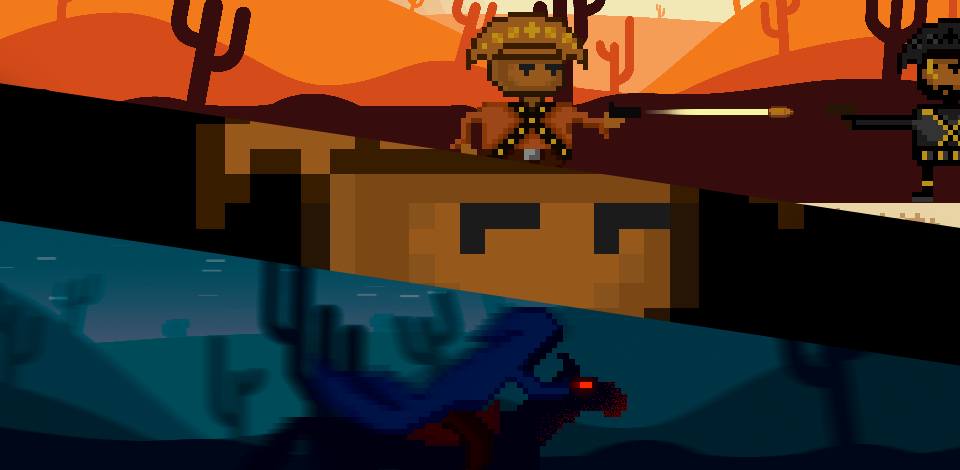

### Olá ! Eu sou o Gustavo Duarte 👋 

)

Entusiasta de tecnologia , programação e desenvolvimento de Jogos. 
Graduado em Jogos Digitais.
3 anos de experiência em projetos com a Unity e C#.
Desenvolvo Automações com Python.
Atualmente focado no Backend (ASP.NET Core MVC).

## Jogos Desenvolvidos 🕹️

- [Cangaceiro](https://union-four.itch.io/o-cangaceiro) 
- [MetroVirus](https://union-four.itch.io/metrovrus) 
- [Bombermano](https://b4rb4br4nc4.itch.io/bombermano) 
- [MazeGunner](https://union-four.itch.io/mazegunner) 
- [Dia do Fogo](https://union-four.itch.io/dia-do-fogo) 

## Tecnologias que eu uso no meu dia 👨🏻‍💻

 

 

